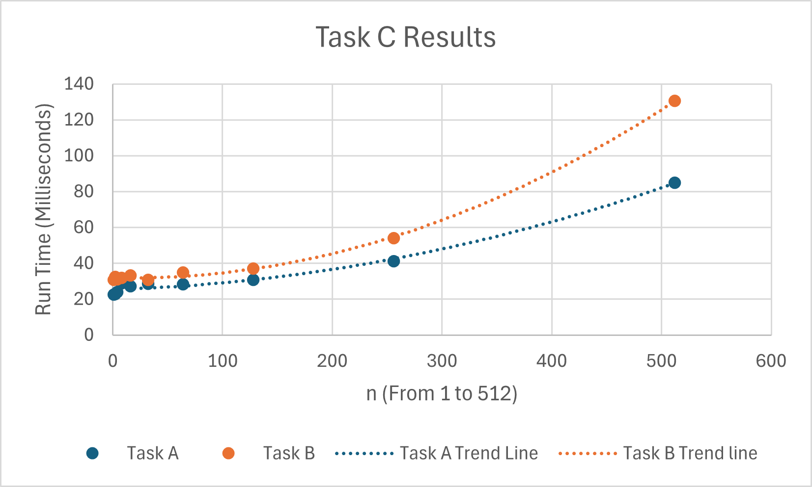

COP4533 Programming Assignment 1

Team Members:
Dohyun Lee (UFID: 92659157)
Charan Sriram (UFID: 73870076)

Project Structure

How to Run
- All commands are assumed to be running from the COP4533_P1 Directory. You should see the README file, and src, data, and tests folders in this directory. We also ran on both linux and windows terminals so adjust python command syntax as necessary for your grading environment.
- (*Note: the input and output files should match each other in the same format as example.in and example.out do in the project spec, they dont have to be valid but that is how to manually check*)

Task A:
1. Add a file to tests folder for input
2. Run the following command: 
    - python3 src/taskA.py tests/inputFilename

Example using preexisting input file: 
- python3 src/taskA.py tests/input.txt

This should output the answer.

Task B:
There are two options for running Task B.
1. You can pipe the output for task A into tests/outputFilename as shown below:
    - python src/taskA.py tests/inputFilename > tests/outputFilename
    - python src/taskB.py tests/inputFilename tests/outputFilename
2. If you are running just Task B without Task A, then you have to manually edit the input and output files you want to use first and then run:
    - python src/taskB.py tests/inputFilename tests/outputFilename

Example following the same structure as before:
- python src/taskA.py tests/input.txt > tests/output.txt
- python src/taskB.py tests/input.txt tests/output.txt

This will print VALID STABLE, UNSTABLE( with the unstable pair ), or INVALID ( message )

Task C:

We used the Measure-Command { command } in windows powershell to time Task A and Task B running through n From 1 to 512 in increments.
This command has a little variability in measured times, however it is able to produce overall accurate and viewable results that show an exponential growth trend for both Task's executions as n becomes increasingly large.

Solution:
- To complete Task C, We ran the src/TaskC.py script in the terminal. This produced all the input files in the data folder. These files are not uploaded to the Github for cleanliness.
- After generating the input files, we executed Task A and piped them into individual output files. Then executed Task B with these files to check.
- Once verifying all the input and output files matched, we reran Task A (without any output piping) and Task B with the Measure-Command in powershell and collected our data.
